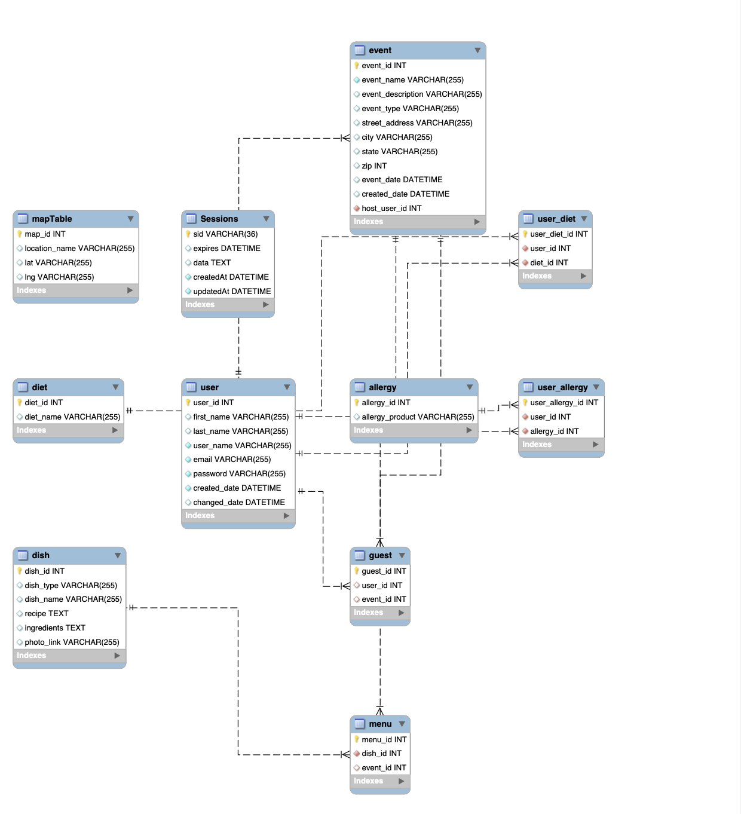

# French-Fry Family Events Manager
## Table of Contents
- [Description](#description)
- [Specification](#specification)
- [Installation]( #installation)
- [Usage](#usage)
- [License](#license)
- [Contributing](#contributing)
- [Tests](#tests)
- [Questions](#questions) 
##  Description
The ReadMe Generator Tool was developed by 
* [Inna Fedorenko, ](https://github.com/InnaFedorenko)
* [Rich]()
* [Amanda]()
* [Alice]()

## Project details:
- [GiHub Link](https://github.com/rstreep/french-fry-event/)
- [Link to Live](https://french-fry-event-83fa51ccd940.herokuapp.com/)
- Date: 07-10-2023

#### The French-Fry Family Events Management Site is a web application designed to streamline event planning and organization for the French-Fry family. This site provides a user-friendly platform for hosts to create events, invite guests, and generate menus based on guest allergies. Guests can conveniently review the events they are invited to and stay informed about the details. 
#### The French-Fry Family Events Management Site offers a seamless and efficient solution for organizing family events. By leveraging features such as authentication, email invitations, allergy management, and event review capabilities, the site simplifies event planning while prioritizing the comfort and satisfaction of all attendees.


### Key Features

```md

* Event Creation: Hosts can easily create events by providing essential information such as event name, date, time, location, and a brief description.

* Guest Invitation: Hosts have the ability to invite guests to their events by sending email invitations through the site. Guests will receive email notifications containing event details and a link to RSVP.

* Authentication: The site incorporates a robust authentication system, allowing users to create new accounts or log in using their email and password. This ensures secure access to event management features.

* Allergy Management: Guests can specify their allergies during the RSVP process. The site utilizes this information to generate customized menus that accommodate guests' dietary restrictions, ensuring a safe and enjoyable experience for everyone.

* Event Review: Guests can easily view and access the events they are invited to. Event details, including event name, date, time, location, and any additional information provided by the host, are readily available for review.
```


## Specification
### [Database Models](Documentation/model.pdf)
Database structure and associations are showed in the following diagram:


### Associations

#### User - Event Associations (host_user_id)
* A `User` can have many `Events` (host_user_id)
* An Event belongs to a User (host_user_id)
#### User - Guest Association
* A `User` can have many `Guests`
* A `Guest` belongs to a `User`
#### Event - Guest Association
* An `Event` can have many `Guests`
* A `Guest` belongs to an `Event`
#### Event - Menu Association
* An `Event` can have many `Menus`
* A `Menu` belongs to an `Event`
#### Menu - Dish Association
* A `Menu` can have many `Dishes`
* A `Dish` belongs to a `Menu`
#### User - Allergy Association
* A `User` can have many `UserAllergies`
* A `UserAllergy` belongs to a `User`
#### Allergy - UserAllergy Association
* An `Allergy` can have many `UserAllergies`
* A `UserAllergy` belongs to an `Allergy`
#### User - Diet Association
* A `User` can have many `UserDiets`
* A `UserDiet` belongs to a `User`
#### Diet - UserDiet Association
* A `Diet` can have many `UserDiets`
* A `UserDiet` belongs to a `Diet`

##  Installation
1. You’ll need to use the [MySQL2](https://www.npmjs.com/package/mysql2), [axios](https://www.npmjs.com/package/axios) , [bcrypt](https://www.npmjs.com/package/bcrypt), [Sequelize](https://www.npmjs.com/package/sequelize),  [express](https://www.npmjs.com/package/express), [express-handlebars](https://www.npmjs.com/package/express-handlebars), [express-session](https://www.npmjs.com/package/express-session),packages to connect your Express.js API to a MySQL database and the [dotenv](https://www.npmjs.com/package/dotenv) package to use environment variables to store sensitive data, [nodemon](https://www.npmjs.com/package/nodemon) and [jest](https://www.npmjs.com/package/jest) for debugging ans testing
run `npm i` to install packages
2. Use the `schema.sql` file in the `db` folder to create your database with MySQL shell commands. 
3. Use environment variables to store sensitive data like your MySQL username, password, and database name (create `.env` file based on your credentials, use `.env.Example` as a reference).
4. Run `npm run seed` to seed data to your database so that you can test your routes.

##  Usage
1. Use `node server` to start the application server (use `npx nodemon server`to debug)
2. Import [API collection](Documentation/Project2_Insomnia_APIContracts.json) and open in the [Insomnia](https://docs.insomnia.rest/insomnia/install) tool
3. configure deployment on Heroku or run locally

## License
  
  This application is covered under the [MIT License](https://opensource.org/licenses/MIT).
##  Contributing
Contributors are welcome.
##  Tests
Testing details are described in the [Testing Plan](Documentation/TestPlan1/TestPlan.md)
##  Questions
If you have any questions, you can reach out to [me](https://github.com/InnaFedorenko) at 
[ivf.fedorenko@gmail.com](mailto:ivf.fedorenko@gmail.com).